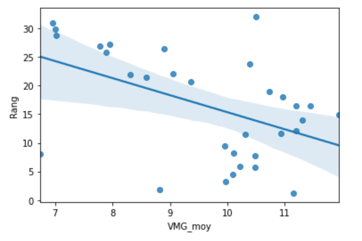
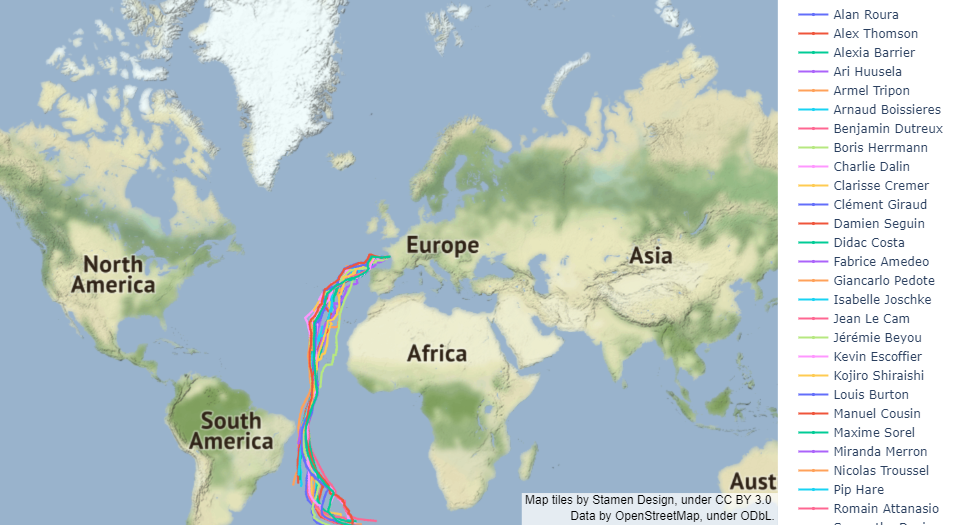

# VendeeGlobe_Live

This project was carried in the framework of Telecom Paris for a course evaluation about data manipulation with Python.
The aim is to extract, visualize and analyze data related to the 2020-2021 Vendée Globe race.

The code written in Python 3 is avalaible in the notebook [Projet](Projet.ipynb)
Here are the main steps.

## A) Extract and pre-processing data

Data are directly scraped from: 
+ https://www.vendeeglobe.org/fr/classement : Excel files recuperation (4 new files per hour)
+ https://www.vendeeglobe.org/fr/glossaire : Informations on skippers and their boats

Data are then cleaned and merged in a dataframe.

## B) Data exploration, visualization and correlations

As a preliminary step before using machine learning algorithms, data are visualized and explored through simple methods. Here is the correlation between speed and ranking:

Visualization of skippers positions and trajectories on Earth is also developed in the notebook (thanks to the Python graphic library Plotly). Besides, this map is up-to-date, as Excel files (including skippers' latitude and longitude) are uploaded every 15 minutes on the website.

## C) Machine Learning algorithms

In this section I used machine learning for:
- Foil detection: KNN, Decision Tree and Logitic Regression
- Ranking prediction: KNN (other algorithms were tried but not relevant)

This project was interesting and rewarding as it has allowed me to manipulate data, from scraping to analyzing and visualizing (the machine learning part was less important and should just be considered as an opening).
